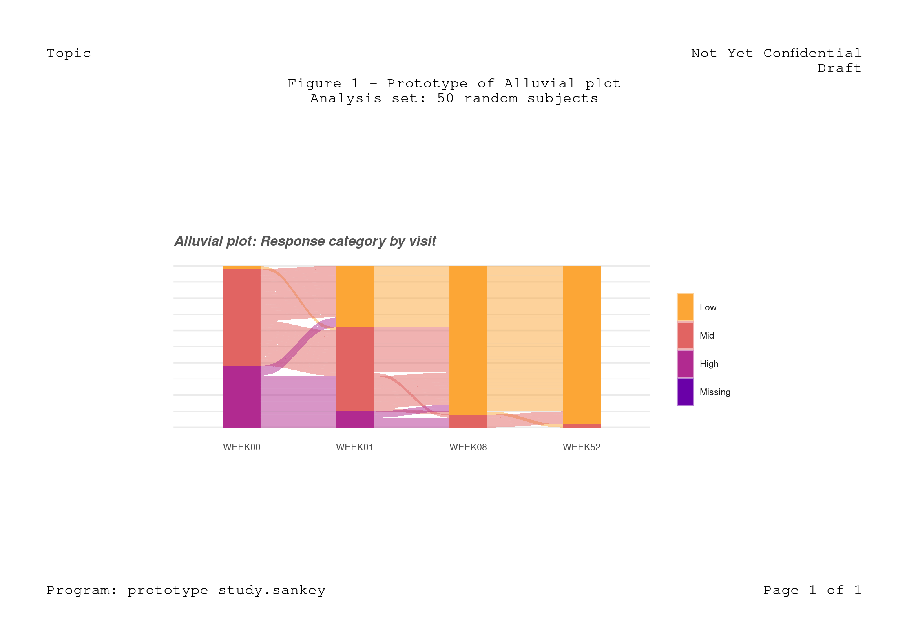

<!-- README.md is generated from README.Rmd. Please edit that file -->
# study.sankey

Available at:

-   Site: <https://fcacollin.github.io/study.sankey>
-   Source: <https://github.com/FCACollin/study.sankey>

``` bash
git clone https://github.com/FCACollin/study.sankey.git
```

``` r
knitr::opts_chunk$set(
  comment = "#>",
  echo = TRUE,
  error = TRUE,
  fig.path = "man/figures/README-",
  comment = "#>",
  out.width = "100%",
  fig.height = 8.3 * .66,
  fig.width = 11.7 * .66,
  dpi = 300
)
```

# 1. Controlled execution

As any R Markdown file, the `params` argument in the YAML front matter offers controlled-execution settings. For instance:

-   when the following parameter is used:

``` yaml
params:
  diag: true
```

-   this code chunk is evaluated and included:

<!-- -->

    ```{r, check, eval=params$diag, include=params$diag}
    devtools::check(quiet = TRUE)
    ```

-   note: `devtools::check()` provides diagnostic/quality information about the package but is lengthy, hence the rendering time is substantially increased for `diag: true`.

``` r
devtools::check(quiet = TRUE)
```

    #> ℹ Loading study.sankey

    #> Loading required package: grid

    #> ── R CMD check results ───────────────────────────────── study.sankey 0.1.0 ────
    #> Duration: 2m 14.2s
    #> 
    #> > checking for unstated dependencies in examples ... OK
    #>    WARNING
    #>   ‘qpdf’ is needed for checks on size reduction of PDFs
    #> 
    #> > checking for future file timestamps ... NOTE
    #>   unable to verify current time
    #> 
    #> 0 errors ✓ | 1 warning x | 1 note x

    #> Error: R CMD check found WARNINGs

The code chunks in `inst/study.R` are identified by `knitr::read_chunk()`; then can then selectively called from the `README.Rmd` file.

``` r
file_nm <- "inst/study.R"
knitr::read_chunk(file_nm)
message("R code chunks read from:\n", file_nm)
```

    #> R code chunks read from:
    #> inst/study.R

## 2. Analysis

``` r
devtools::load_all()
```

    #> ℹ Loading study.sankey

``` r
library(ggalluvial)
```

    #> Loading required package: ggplot2

``` r
library(dplyr)
```

    #> 
    #> Attaching package: 'dplyr'

    #> The following objects are masked from 'package:stats':
    #> 
    #>     filter, lag

    #> The following objects are masked from 'package:base':
    #> 
    #>     intersect, setdiff, setequal, union

``` r
library(magrittr)
```

### 2.1. Dataset preparation

``` r
test_dta <- adam_ww(50)
attach(test_dta, warn.conflicts = FALSE)

knitr::kable(head(adsl), caption = "Dummy ADSL dataset")
```

|     | USUBJID     | TRT                      |  BASELINE| ARMCD |
|:----|:------------|:-------------------------|---------:|:------|
| 37  | SUBJECT 037 | ACTIVE TREATMENT DOSE 01 |      27.8| ARM B |
| 39  | SUBJECT 039 | ACTIVE TREATMENT DOSE 01 |      25.0| ARM B |
| 40  | SUBJECT 040 | ACTIVE TREATMENT DOSE 01 |      20.7| ARM B |
| 105 | SUBJECT 105 | ACTIVE TREATMENT DOSE 01 |      22.8| ARM B |
| 111 | SUBJECT 111 | ACTIVE TREATMENT DOSE 01 |      16.9| ARM B |
| 121 | SUBJECT 121 | ACTIVE TREATMENT DOSE 01 |      21.2| ARM B |

``` r
knitr::kable(head(adpasi), caption = "Dummy ADPASI dataset")
```

| USUBJID     | AVISIT |  AVAL| PARAMCD |
|:------------|:-------|-----:|:--------|
| SUBJECT 037 | WEEK00 |  27.8| PASITOT |
| SUBJECT 039 | WEEK00 |  25.0| PASITOT |
| SUBJECT 040 | WEEK00 |  20.7| PASITOT |
| SUBJECT 105 | WEEK00 |  22.8| PASITOT |
| SUBJECT 111 | WEEK00 |  16.9| PASITOT |
| SUBJECT 121 | WEEK00 |  21.2| PASITOT |

``` r
ads <- adpasi %>%
  filter(AVISIT %in% c("WEEK00", "WEEK01", "WEEK08", "WEEK52")) %>%
  mutate(
    time = factor(AVISIT),
    rsp = cut(AVAL, breaks = 3, labels = c("Low", "Mid", "High")),
    rsp = add_missing(rsp),
    subj = gsub("^SUBJECT (.*)$", x = USUBJID, replacement = "\\1")
  ) %>%
  select(subj, time, rsp) %>%
  arrange(rsp, time, subj)

knitr::kable(
  x = head(ads),
  # lintr demo: only use double-quotes
  caption = 'Outlook of the analysis dataset data'
)
```

| subj | time   | rsp |
|:-----|:-------|:----|
| 187  | WEEK00 | Low |
| 040  | WEEK01 | Low |
| 111  | WEEK01 | Low |
| 248  | WEEK01 | Low |
| 299  | WEEK01 | Low |
| 307  | WEEK01 | Low |

### 2.2. Graphics

``` r
# lintr demonstration: commented code should be removed
# test <- viridis::viridis(5)

# lintr demonstration: keep using snake_case for variable and functions names
colorScale <- color_scale <-  viridis::viridis(
  nlevels(ads$rsp),
  begin = .2, end = .8, option = "C",
  direction = -1
)
names(color_scale) <- levels(ads$rsp)

gg_sankey <- ads %>%
  ggplot(aes(x = time, stratum = rsp, alluvium = subj, fill = rsp)) +
  geom_stratum(colour = NA) +
  geom_flow(stat = "alluvium", color = "gray85", lwd = .01) +
  ggtitle("Alluvial plot: Response category by visit") +
  scale_fill_manual(values = color_scale) +
  theme_diane()
```

``` r
gg_sankey <- clean_slate(margin = unit(c(1, 1, 1, 1), "cm")) %>%
  add_header(left = "Topic", right = c("Not Yet Confidential", "Draft")) %>%
  add_title(c(
    "Figure 1 - Prototype of Alluvial plot",
    "Analysis set: 50 random subjects"
  )) %>%
  add_figure(gg_sankey, width = unit(5, "in"), height = unit(2, "in")) %>%
  add_footer("Program: prototype study.sankey", "Page 1 of 1") %T>%
  grid.draw()
```


