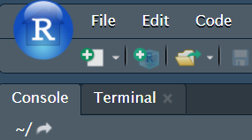
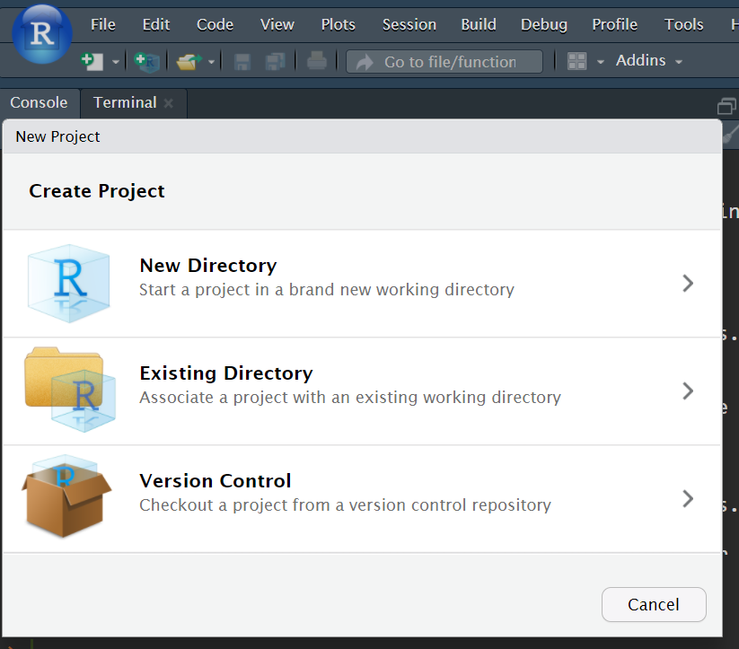
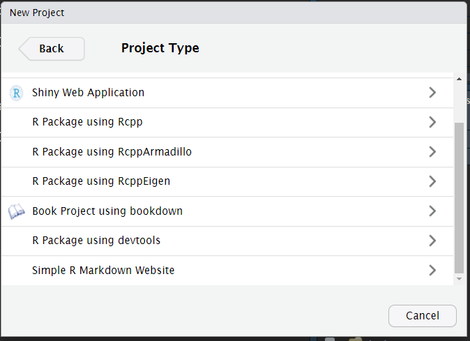
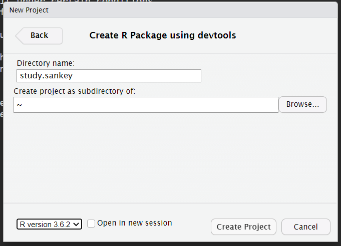
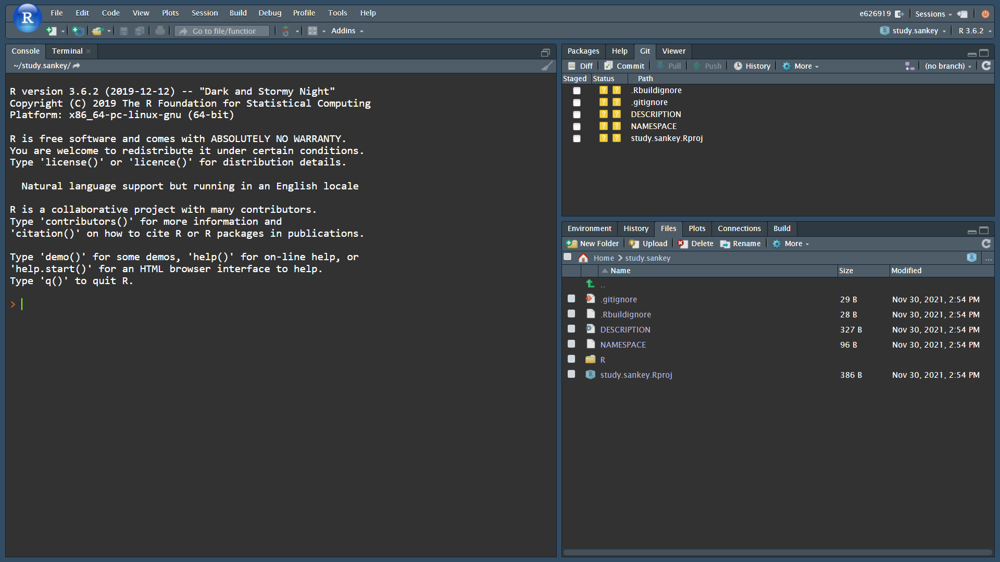
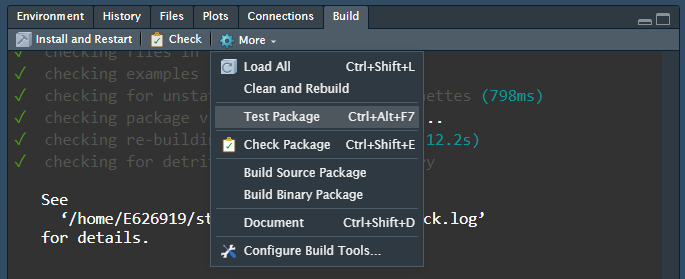
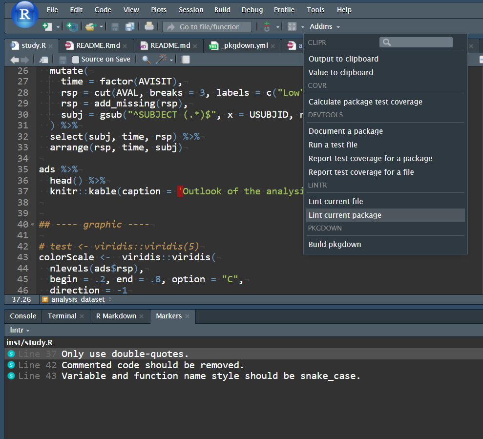

```{r, include = FALSE}
knitr::opts_chunk$set(
  collapse = TRUE,
  comment = "#>"
)
```

Targets:

- Awareness: the structure of R packages offers more than simply packing new
  functionalities. It is also a place to share datasets and statistical
  analysis.
- RStudio offers functionalities supporting this approach.


1. Example use case
===================

Lets consider an example:
_I need to run a statistical analysis resulting in a Sankey diagram_.


In a `script.R`:

- prepare a dummy set of data following the Analysis Data Model
  (ADaM, [CDISC](https://www.cdisc.org/standards/foundational/adam)).
- pre process the data (e.g. filter, transformations).
- obtain the graph.

```{r}
# Dummy collection of ADaM datasets: ADSL and ADPASI

raw <- read.table(
  file.path(
    "https://raw.githubusercontent.com/VIS-SIG/Wonderful-Wednesdays",
    "master/data/2021/2021-04-14/WWW_SustainedResponse.csv"
  ),
  header = TRUE,
  sep = ",",
  stringsAsFactors = FALSE
)

library(tidyr)
library(dplyr)
raw <- as_tibble(raw)

adsl <- raw %>%
  distinct(USUBJID, TRT, BASELINE) %>%
  mutate(
    ARMCD = factor(
      TRT,
      levels = c(
        "COMPARATOR TREATMENT",
        "ACTIVE TREATMENT DOSE 01",
        "ACTIVE TREATMENT DOSE 02"
      ),
      labels = c("ARM A", "ARM B", "ARM C")
    )
  )

adpasi <- raw %>%
  select(-TRT) %>%
  gather(key = "AVISIT", value = "AVAL", -USUBJID) %>%
  mutate(
    AVISIT = ifelse(AVISIT == "BASELINE", "WEEK00", AVISIT),
    PARAMCD = "PASITOT"
  ) %>%
  select(USUBJID, PARAMCD, AVISIT, AVAL)


# Analysis dataset preprocessing

# function: replace missing levels of a factor by "Missing"
add_missing <- function(x) {
  ll <- levels(x)
  ll <- c(ll, "Missing")
  x <- as.character(x)
  x <- ifelse(is.na(x), "Missing", x)
  factor(x, levels = ll, exclude = NULL)
}

set.seed(3)
ads <- adpasi %>%
  filter(AVISIT %in% c("WEEK00", "WEEK01", "WEEK08", "WEEK52")) %>%
  mutate(
    time = factor(AVISIT),
    rsp = cut(AVAL, breaks = 3, labels = c("Low", "Mid", "High")),
    rsp = add_missing(rsp),
    subj = gsub("^SUBJECT (.*)$", x = USUBJID, replacement = "\\1")
  ) %>%
  select(subj, time, rsp) %>%
  filter(subj %in% sample(unique(subj), 200)) %>%
  arrange(rsp, time, subj)


# Generate the graphic
library(ggalluvial)

color_scale <- setNames(
  viridis::viridis(4, begin = .2, end = .8, option = "C", direction = -1),
  nm = levels(ads$rsp)
)
ggplot(ads, aes(x = time, stratum = rsp, alluvium = subj, fill = rsp)) +
  geom_stratum(colour = NA) +
  geom_flow(stat = "alluvium", color = "gray85", lwd = .01) +
  scale_fill_manual(values = color_scale)
```


Result, it is working and:

- rely on a new function (`add_missing()`).
    + _"I will probably need that in the future for another request"_
- nice to have: decide the number of subjects for the examples, could be
  a new function, to generate dummy data on demand.
    + _"That so convenient to have ready to work dummy datasets!"_
- needs functions which are defined in other projects:
    + _"Oh! I remember, I already coded this for a previous analysis!"_:
      + `clean_slate()`: figure annotations (header, title, notes and footer).
      + `preview()`: preview the generated pdf itself.


# 2. Package equivalence

## 2.1. Overview

### Create a R project package

Either use `devtools::create()`, or follow the RStudio user interface in
5 clicks:

{ width=50% }

---

{ width=50% }

---

{ width=50% }

---

{ width=50% }

---

{ width=50% }

---


2. Move the script in `inst/`, a permissive area of the package.
    + makes sections to enable _show/hide document outline_ in RStudio
    interface, and make section _knit-able_ for controlled execution;
    for instance:

```r    
## ---- settings ----

devtools::load_all()
library(ggalluvial)
library(dplyr)
library(magrittr)
```

---

3. The folder `R/` contains the documented functions:
    + a new function to create a dummy dataset from Wonderful Wednesday PASI
    example: `adam_ww()`.
    + a new function to add missing data: `add_missing()`, similar to `addNA()`.
    + copy-paste function developed in other project:
        + `preview()`
        + `clean_slate()` family.

The markup system [roxygen2](
https://cran.r-project.org/web/packages/roxygen2/vignettes/roxygen2.html
), helps making a complete documentation.
Example with the function `add_missing()` in `R/add_missing.R`.

```{r}
#' Factor: NA is "Missing" level
#'
#' Assign the value "Missing" to missing values of a factor. Built as [addNA()].
#'
#' @param x (`factor`)
#' @param missing_lvl (`character`)
#'
#' @export
#' @examples
#'
#' animals <- as.factor(c("cat", "dog", NA))
#' animals
#' add_missing(animals)
#'
add_missing <- function(x, missing_lvl = "Missing") {

  assertthat::assert_that(is.factor(x))

  ll <- levels(x)
  ll <- c(ll, missing_lvl)
  x <- as.character(x)
  x <- ifelse(is.na(x), missing_lvl, x)
  factor(x, levels = ll, exclude = NULL)
}
```


## 2.2. Practically

Transfering a script in a package is not a drastic change:

- keep working with `script.R`
- once a function is identified, write in `R/`.

Frequently asked qestions:

- "_Many files, will not this be complicated to find a file/function in the
   project?"_
    + `<F2>`: Go to function definition.

- "_Many files, should every file be sourced with `source()`_":
    + `devtools::load_all()`: load all the package, all the function becomes
    available similarly to a `library()` call for an installed package
    (even the manual pages).

- "_Many files, how a programmer/reviewer knows where to start?_"
    + `usethis::use_readme_rmd()`, use `knitr::read_chunk(inst/study.R)` to
    screen the script sections, and use empty but named R code chunk to
    decide which section to execute, in which order.
    + Good because:
        - there are sections needed for development only, but not for the
        program run (e.g. preview) while commented code is bad practice.
        - room for contextual information (e.g. a decision made because
        of an unexpected finding).
        - alternative for the Don't Repeat Yourself principle:
        a code chunk can be called several times.
        For instance, as ggplot is a framework enhancing the readability
        of the involved graphical layers, it is sometimes a shame to wrap a
        ggplot code section into a function, better to repeat its execution.
        

# 3 Perspectives:

Standard format comes with standard-support tools:

- **R Markdown/README/RStudio**:
  the program run is as simple as clicking on the knit button.
- **devtools**:
    + `<ctrl>+<shift>+<d>`, equivalent to `devtools::document()`,
    updates the documentation (populates the `NAMESPACE` file and `man/`
    folder).
    + `<ctrl>+<shift>+<e>`, equivalent to `devtools::check()`,
    verifies a large number of standards (e.g. functions are well documented,
    dependencies are well accounted for, examples are working).

{ width=50% }

- `lintr::lint()`:
    + helps checking the code is lint-free, clean. Helps in the adoption of
    good practices and standard.

{ width=50% }

- `pkgdown`:
    + build a website: the result `README.md` becomes the home page, functions
    are documented in `reference`, vignette added in `articles`.
    + all functions are cross-referenced: the link `adam_ww()`, will bring you
    to the right page.


And much more:

- **data**: contains datasets, possibly along with the preprocessing code.
- **templates**: complexe templates ins `inst/rmarkdown/`.
- `vignettes/`: use (e.g. the present document).
- `tests/`: place for automated test (e.g. test that the ADSL data
  returned by `adam_ww` is such as `USUBJID` is the unique row identifier).
- Git integration.
